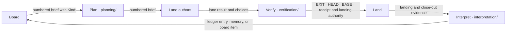

# Agent Factory

An agent-driven software factory covering the full SDLC — from idea to
production and continuous improvement. Distilled from a production factory
that ran multi-lane parallel builds, landing trains and owner-governed
decision loops for months; everything repo-specific has been removed,
everything deterministic (gates, skills, CI, harness scripts) is included as
adapted code — every adaptation is recorded in `skills/ATTRIBUTION.md`.

**Installation is agent-driven:** point an LLM agent (Claude Code, a coding
CLI or similar) at `INSTALL.md` inside your target repo. The agent
parameterizes the deterministic pieces against your language, build chain
and domain.

**How to read this file.** §3 is the whole loop with a pointer at every hop;
§10 is the index from a question to its home. Everything else is a hub: a
pointer plus a one-sentence gloss, never a second statement of a rule — each
rule has one home, cited as `pillar/file.md §N`, and
`verification/tests/test_hub_pointers.sh` checks that every such pointer
here and in `INSTALL.md` — a `§N` continuation, a pointer wrapped across a
line and a quoted heading included — resolves. No mechanism is named
without its form tag — gate, guard, hook, ruleset or text (§5.2). Counts are pointers, or covered by that
test.

## 0. The core loop

At either altitude, every handoff is explainable from its artifact and inspectable with a concrete command; installation fills the target codebase's parameters (`INSTALL.md`).

Capability specs are the durable *what* the plan hop reads and the land hop
updates; ADRs stay the durable *why* (`planning/capability-specs.md §1`, `§4`).

Planning can define but cannot prove or learn without verification and interpretation; verification can test but cannot choose intent or explain outcomes without planning and interpretation; interpretation can explain but cannot authorize or prove a change without planning and verification (`planning/core-model.md`; `verification/verify-portfolio.md`; `interpretation/continuous-improvement.md`).

### Inspect it

| Hop | Form | Input it reads | Evidence it writes | One command that shows current state |
|---|---|---|---|---|
| Board → plan | text | The full board item and approved spec (`planning/board-protocol.md` "Statuses"; `planning/core-model.md`). | A numbered brief with `Kind:` (`planning/lane-brief-template.md §1`, `§4`). | `gh project item-list <number> --owner <owner> --limit 200 --format json` — reads the authoritative board without the default-page blind spot (`planning/board-protocol.md` "Authority, pagination and derived views"). |
| Plan → lane authors | guard | The brief, pin and model binding (`harness/run-lifecycle.md §3`; `harness/model-policy.md §4`). | The run's start receipt and resolved artifact paths (`harness/run-lifecycle.md §2`, `§4`). | `harness/launch_lane.sh env` — prints the resolved launch contract without secrets (`harness/run-lifecycle.md §3`). |
| Autonomous loops | text | The loop identity, owner, expected end, stop command, and liveness proof (`harness/run-lifecycle.md §12`). | One local status row for every lane, evaluation, watch, loop, or server (`harness/run-lifecycle.md §12`). | `harness/loop_registry.sh list` |
| Lane authors → verify | gate | The lane worktree plus the brief's pregate and matching legs (`planning/lane-brief-template.md §4`; `verification/verify-portfolio.md` "Legs that bring lane-green closer to train-green"). | A run-bound lane result with proof and choices (`harness/report-schema.md` "Machine check at handback"). | `harness/launch_lane.sh verdict` — reports the current run's deliverable state from its receipts (`harness/run-lifecycle.md §5`). |
| Verify → land | guard | The assembled tree, its `EXIT= HEAD= BASE=` receipt, and a live ruling or active policy (`harness/train-plan.md §4.1`; `verification/lander-duties.md §7`). | The receipt-bound `local-verify` status and landing decision (`verification/protections.md §3`; `verification/landing-modes.md §2`). | `sed -n '1,4p' <artifacts>/<run-id>.exit` — exposes the four-line receipt the lander judges (`harness/train-plan.md §4`). |
| Land → capability specs | gate | The boarders' deltas (`planning/capability-specs.md §3`). | The archived change and merged spec, committed with the train (`planning/capability-specs.md §4`). | `ls openspec/changes \| grep -v '^archive$'` prints nothing on the default branch; `test -d openspec/changes/archive && test "$(find openspec/changes -mindepth 1 -maxdepth 1 \| wc -l \| tr -d ' ')" -eq 1` also refuses a missing tree. |
| Land → interpret | guard | The registered landing, boarded SHAs and open close-out duties (`verification/lander-duties.md §8`). | Landing registration and close-out evidence for the ledger (`verification/protections.md §6`; `interpretation/choices-ledger-README.md §1`). | `python3 verification/gates/check_landing_closeout.py --state <state-file>` — prints the duties still open (`verification/lander-duties.md §8`). |
| Interpret → board | text | Lane choices, verify findings and landed evidence (`interpretation/choices-ledger-README.md §1`, `§4`). | A ledger entry, one-fact memory, or new board item (`interpretation/memory-conventions.md`; `interpretation/continuous-improvement.md`). | `git log --grep '<choice-id>'` — follows a stable choice ID into history (`interpretation/choices-ledger-README.md §2`). |

Three non-negotiables inherited from the source factory:
1. **Falsify the apparatus before the product** — a gate or test that has
   never been seen red proves nothing (`verification/falsification.md`).
2. **Never weaken a criterion to pass** — ratchets move one way; baselines
   change only through each gate's own `--update`, and a gate leg catches
   the rest (`verification/protections.md §7`).
3. **Honesty on every surface** — unavailable is never rendered as empty;
   advisory output is labeled advisory; a result claims no more than its
   receipt's `proves:` line (`verification/evaluation-readiness.md §1`).

## 1. Who does what

| Role | Does | Never does | Home |
|---|---|---|---|
| Owner / operator | approves specs; rules on Decision-needed items; signs the two user-level policy files (model, landing) | grants authority by chat; edits code mid-lane | `planning/core-model.md`; `user-level/README.md` |
| Orchestrator | files board items, allocates numbers, writes briefs from the standing template, declares the change kind, audits choices, presents the ledger | authors in a lane's tree; guesses to keep moving | `planning/execution-contract.md §1`; `planning/adr-and-numbers.md` |
| Wrapper | cuts the worktree, launches the lane, commits under the writer lock, falsifies red→green, runs the result lint, pushes the lane branch | pushes main; reads a verdict from a pipe | `planning/execution-contract.md §6`; `harness/run-lifecycle.md §11` |
| Lane | authors in its own worktree under one brief; runs the pregate block and the matching diff-triggered legs; files its report however it exits | pushes; opens a pull request; runs full verify; allocates a number | `planning/lane-brief-template.md §2` |
| Proof owner | reruns the apparatus the lane cannot run, over the whole observed run | passes a partial rerun off as the whole | `planning/execution-contract.md §2` |
| Lander | assembles the train, runs one full verify, reads the receipt, re-derives the kind, lands under authority, closes out | lands on a pipe status; lands without authority | `verification/lander-duties.md §1`, `§7`, `§8` |
| CI | re-verifies the landed commit and deploys; advisory lanes comment | gates a landing (until promoted by a reviewed diff) | `verification/landing-modes.md §4.3`; `verification/ci/README.md §2` |

Vocabulary: a **task** is a board item ID and the round counter follows it; a
**round** is one authoring pass plus its proof attempt; the **apparatus** is
whatever decides that a delivery works; a **train** is one worktree where
independent ready lanes are merged and verified together; a **receipt** is a
run-bound file a verdict is read from (`EXIT=`, `HEAD=`, `BASE=`); the
**ledger** is the train's choices protocol (`planning/execution-contract.md
§1`; `harness/train-plan.md §4`; `interpretation/choices-ledger-README.md §1`).

## 2. The three pillars

| Pillar | Question it answers | Contents |
|---|---|---|
| **`planning/`** | *Define why, what, how* | The board as planning truth, the ladder from idea to approved spec, the standing lane brief and the read-only investigation brief, the decision brief, the execution contract (measurement baseline, two rounds, first-contact STOPs, change kind), ADRs and the number registry, backlog teeth. Start at: `planning/core-model.md`. |
| **`verification/`** | *Prove that it works* | The verify portfolio and its cheap legs, the deterministic gate scripts (which port: `verification/gates/README.md`), falsification norms with a runnable identity-and-history example, evaluation readiness, the CI regime, lander duties, landing modes, and the protections — git hooks, ruleset, status, ledger lint, close-out, never-weaken. Start at: `verification/verify-portfolio.md`. |
| **`interpretation/`** | *Understand how it really works* | The choices ledger, memory conventions, investigation practice (instrument first, consumer inventory, identity and history), evaluation practice (what each result may claim), a worked simplification review, the improvement loop. Start at: `interpretation/choices-ledger-README.md`. |

## 3. Life of a change

Each step: artifact → owner → next reader, then its home. Tags: (gate)
(guard) (hook) (ruleset) (text) — §5.2.

1. A board item whose body says why → Planned with a full spec → the owner's
   approval recorded on the item; orchestrator → brief writer
   (`planning/board-protocol.md` "Statuses"; `planning/core-model.md`).
2. Uncertain cause: a read-only investigation brief on frozen evidence at a
   pinned SHA → a falsified causal model → a fix brief or a Decision-needed
   item, never code (`planning/investigation-brief-template.md §0`, `§8`).
3. Every ADR or migration number is claimed first on its claims-only lane,
   which boards the train; the drift leg (gate) reads it at assembly
   (`planning/adr-and-numbers.md`).
4. The lane brief from the standing template — task ID, round, pin,
   numbers, measurement baseline and proof owner, model/effort line, kind
   line, legs table — orchestrator → wrapper; item → In flight
   (`planning/lane-brief-template.md §1`, `§4`;
   `planning/execution-contract.md §2`, `§9`; `harness/model-policy.md §4`).
5. The wrapper: worktree at the pin, ritual, writer lock, launcher with
   run-bound receipts → three questions: started, alive, deliverable
   (`harness/worktree-ritual.md`; `harness/run-lifecycle.md §1`, `§4`, `§5`).
6. The lane: authors; writes a capability delta for every behaviour change,
   or carries the applicable no-delta trailer; pregate block plus matching
   legs (gate) with the import root pinned; sentinel; `<lane>-result.md` with
   `choices:` however it exits; STOP on first contact, PARK at the ceiling
   or after round two (`planning/capability-specs.md §3`;
   `harness/report-schema.md`; `planning/execution-contract.md §3`–`§6`).
7. The wrapper: result lint, red→green falsified after committing, identity
   and trailer (hook), lane branch pushed — built or parked
   (`harness/report-schema.md` "Machine check at handback";
   `verification/falsification.md` rule 1; `verification/protections.md §1`).
8. The orchestrator: `audit-choices` on the handback → one entry per
   invented decision with a stable ID in `docs/choices/<train>.md`; unsound
   resolved before assembly (`interpretation/choices-ledger-README.md §1`–`§4`).
9. The lander: train worktree at origin/main, the resource contract (hard
   stops before the heavy run), `--no-ff` merges of pinned SHAs, every live
   capability delta archived in stable order before cross-checks, the kind
   re-derived from the real diff (text — a lander duty today; a `context`
   guard when M-21 ships, `harness/guards.md §6`), cross-checks, ledger
   committed with the train (`planning/capability-specs.md §4`;
   `verification/lander-duties.md §1`, `§2`; `harness/train-plan.md §2`,
   `§3`).
10. The lander: build and stamp; cheap gates by exit code (gate);
    import-root probe; resource check; ONE full verify read only from
    `EXIT= HEAD= BASE=` — the `verdict` rule (guard) refuses a pipe
    (`harness/train-plan.md §4.1`; `harness/guards.md §7`).
11. Authority: a live ruling on the item, or an active signed policy with no
    `holds:` firing (text); neither → HOLD as an open pull request with a
    decision brief (`verification/lander-duties.md §7`;
    `user-level/landing-policy.example.md §1`, `§2`).
12. Land: train branch pushed, `local-verify` posted, the pull request
    merged `--merge --match-head-commit <HEAD=>` — or the documented direct
    push; the same check runs as the ruleset (ruleset) and the `landing`
    rule (guard) in pr mode, and as the pre-push hook (hook) in the
    override mode (`verification/landing-modes.md §1`–`§5`;
    `verification/protections.md §1.1`, `§2`, `§3`).
13. Registration: origin/main CONTAINS `HEAD=`, never equals;
    `landing-in-progress.json` written (`verification/landing-modes.md §4.6`;
    `verification/protections.md §6`).
14. Close-out, both modes: NUMBERS flipped, board sweep, one `landed`
    notification per item, primary fast-forwarded, worktrees reaped after
    the ancestor check; the close-out check (gate) and the stop-event rule (guard)
    hold the session until done (`verification/lander-duties.md §8`;
    `planning/board-protocol.md` "Notifications").
15. CI re-verifies and deploys; read at the next session start as a signal
    (text), never the gate (`verification/landing-modes.md §4.3`;
    `verification/protections.md §4`).
16. Evaluation on an isolated bank copy under an admission receipt whose
    `proves:` line is the whole claim; findings → board items
    (`verification/evaluation-readiness.md §1`–`§4`; `harness/artifact-bank.md
    §3`, `§6`).
17. Lessons → memory, one fact per file, pointing at bank names; a rule
    change → a reviewed diff to the operations doc; a machinery change → a
    pilot with a measurement (`interpretation/memory-conventions.md`;
    `interpretation/continuous-improvement.md`).

## 4. Planning end to end

- **4.1 The board is planning truth** — statuses, the transaction table,
  Decision needed as a state with a document, one notification per
  transition, full-board enumeration, derived views never a second plan
  (`planning/board-protocol.md`).
- **4.2 The ladder** — why → what (a full spec; the write-spec ceremony
  for risky work) → owner approval → how (the standing brief) → proof; the
  ceremony scales by slicing risk, not by a tier flag; dates are real; a
  model change is an owner decision (`planning/core-model.md`).
- **4.3 Briefs** — the lane brief parameterizes and never restates; the
  investigation brief precedes a fix brief when the cause is uncertain; the
  decision brief is what the owner reads instead of the conversation
  (`planning/lane-brief-template.md`;
  `planning/investigation-brief-template.md §0`, `§8`;
  `planning/decision-brief-template.md`).
- **4.4 The execution contract** — measurement baseline, two rounds per
  task ID, decision versus repetition, first-contact STOPs, PARK versus
  STOP and who pushes, the change kind
  (`planning/execution-contract.md §2`–`§6`, `§9`).
- **4.5 ADRs and numbers** — claim first, orchestrator-only, board the claim
  branch, then flip on the assembled train before its final run; the drift
  leg (gate) finds a stale `claimed` row already on main
  (`planning/adr-and-numbers.md`; `planning/NUMBERS-template.md`;
  `verification/protections.md §7`).
- **4.6 Backlog teeth** — cited-or-stamped specs and closing evidence are a
  gate, not a heuristic (`planning/backlog-discipline.md`;
  `verification/gates/check_backlog.py`).

## 5. Verification end to end

- **5.1 Four layers** — lane pregate plus diff-triggered legs; train
  cross-checks and cheap gates (docs held by backlog teeth,
  `planning/backlog-discipline.md`; a paired-artifact check is a method the
  installer may port from the domain rows of `verification/gates/README.md`);
  ONE full verify on an idle machine with a run-bound receipt; CI
  re-verifies and is adjudicated (`verification/verify-portfolio.md`;
  `harness/train-plan.md §3`, `§4`; `verification/lander-duties.md §1`).
- **5.2 Form legend, and what runs where.** *Gate*: inside verify or among
  the cheap gates; fails closed; no switch. *Guard*: hook-mounted; one
  signal; fails open on its own crash; one switch per rule that leaves a
  trace; a denial names the alternative. *Hook*: a git hook carrying the
  same rules into any harness. *Ruleset*: the hosting side refuses. *Text*:
  advisory — a reader may reject it — including reminders with a
  deterministic trigger (`harness/guards.md §1`, `§4`, `§5`;
  `verification/protections.md §1`, `§2`).

  | Moment | Deterministic (gate / guard / hook / ruleset) | Text |
  |---|---|---|
  | Lane, before commit | pregate block; matching legs-table rows (gate rows — selection by the lane's reading of the table, text until a runner ships) | the brief's hard rules; first-contact STOPs |
  | Wrapper, at handback | result lint (wrapper check; a guard on the harness's subagent-stop event); red→green falsification | the choices audit |
  | Any commit | identity leg, trailer on source commits (hook); `--no-verify` refused in a hooked session (guard) | subject form (WARN) |
  | Assembly | cross-checks; cheap gates incl. drift leg, never-weaken, ledger lint (gate); `verdict`, `identity` (guard) | kind re-derivation (a lander duty today; a `context` guard when M-21 ships); the batch rule (independent lanes share a train) |
  | Full verify | the receipt launcher; the resource contract's hard stops (before the heavy run) | adjudicating a red X |
  | Landing | `landing` rule (guard); pre-push (hook); ruleset; status poster | landing authority: a ruling or a signed policy |
  | Close-out | close-out check (gate); stop-event rule (guard) | board sweep; notifications |
  | Session start | CI signal, bindings, hook status (text with a deterministic trigger) | the memory nudge |
  | CI | re-verify workflow; advisory lanes comment | promotion by reviewed diff |

- **5.3 Blast radius is decided by content, not by path.** The
  proportional-rigor family: first-contact STOPs (text —
  `planning/execution-contract.md §5`); the `holds:` floor that stops a
  train even under authority (text — `user-level/landing-policy.example.md
  §2`); effort follows irreversibility (text — `harness/model-policy.md §2`);
  the docs-only receipt and its classifier (guard + hook —
  `harness/train-plan.md §4`; `verification/protections.md §1.1`);
  path-triggered legs — `ui-pass:` on the UI glob (guard + hook), the
  trailer on the source prefix (hook), the diff-triggered legs table (gate
  rows — `verification/protections.md §1.2`; `verification/verify-portfolio.md`
  "Legs that bring lane-green closer to train-green"); the change kind,
  declared from the planned file set and re-derived from the real diff —
  a kind that rose is applied and announced, a kind that fell is a ledger
  entry (text — a lander duty today; a `context` guard when M-21 ships,
  the legs it selects being the hard ones — `planning/execution-contract.md
  §9`; `harness/guards.md §6`); the
  trivial-lane exemption (text — `skills/ROUTING.md` rule 2); never-weaken
  over the control plane (gate — `verification/protections.md §7`). Keyed
  by what the diff contains and what a change can undo, never by a path
  tier; each consequence is a receipt, a leg or a STOP, never a reviewer
  count; escalation is a ruling on the item, never a keyword. A path-tier
  table needs one classifier and tends to grow several that disagree, and
  a rule with two homes diverges; a content-keyed family needs one
  classifier, derived from the parameters the landing guard already binds
  (`planning/execution-contract.md §9.3`), never a second table.
- **5.4 Landing** — one procedure, two last steps: the train branch pushed
  and `local-verify` posted on `HEAD=`, then the pull request merged under
  authority (default) or the documented direct push; authority is a ruling
  on the item or an active policy with no hold firing, else HOLD; contains,
  never equals; the batch rule (independent lanes share a train); the
  continue contract (conflict and resume); the ten close-out duties; a
  skipped required check rejects (`verification/landing-modes.md §1`–`§6`; `verification/lander-duties.md §2`, `§3`, `§7`, `§8`).
- **5.5 Evaluation readiness and the artifact bank** — three evaluation
  types never conflated; the `proves:` receipt; a skip on a required check
  rejects; pristine acceptance; exercise the copy, never the source
  (`verification/evaluation-readiness.md §1`–`§6`; `harness/artifact-bank.md
  §1`–`§9`).
- **5.6 Falsification** — the three non-negotiables above are read through
  `verification/falsification.md`, through `verification/verify-portfolio.md`
  "Known vacuity classes" and through each chapter's "What the test proves"
  (`harness/guards.md §13`; `verification/protections.md §10`); a lens that
  passes when any file exists, a regex over whole-file legacy content and a
  check ending in `|| true` are the vacuity classes this rule exists for.

## 6. Interpretation end to end

- **6.1 The choices ledger is a transaction point** — handback `choices:` →
  audit → one entry per invented decision with a stable ID → unsound
  resolved before assembly → committed with the train → the pull-request
  body → the `## Landing` fields (mode, receipts, status, `ui-pass:`,
  `kind:`) → the ledger lint (gate) (`interpretation/choices-ledger-README.md
  §1`–`§4`; `verification/protections.md §5`).
- **6.2 Memory** — one fact per file plus an index; a trail, never an
  authority; bank names, never scratch paths; a nudge, never a block
  (`interpretation/memory-conventions.md`).
- **6.3 Investigation practice** — instrument first; investigate before the
  fix mandate; STOP (a wrong causal model) versus PARK (rounds exhausted);
  the consumer inventory before any move, split or delete; identity and
  history (`interpretation/investigation-practice.md`;
  `verification/examples/identity-and-history.md`).
- **6.4 Evaluation practice** — what each result type proves, state parity,
  honest metrics (`interpretation/evaluation-practice.md`).
- **6.5 The improvement loop** — incident → finding → board item → pilot
  with a measurement → reviewed diff to the operations doc
  (`interpretation/continuous-improvement.md`; `harness/guards.md §11`).

## 7. Shared infrastructure

- **`skills/`** — vendored skills under a content lock, verified by
  `skills/verify_skills_lock.py` and falsified by its test; routing by
  factory step (`skills/ROUTING.md`); provenance (`skills/ATTRIBUTION.md`).
- **`harness/`** — the run lifecycle's three questions and run-bound
  verdicts (`harness/run-lifecycle.md §1`, `§5`); the report schema and its
  machine check (`harness/report-schema.md`); the worktree ritual and the
  import-root probe (`harness/worktree-ritual.md`); the launcher
  (`harness/launch_lane.sh`); the train plan with the resource contract and
  the receipt (`harness/train-plan.md`); the artifact bank
  (`harness/artifact-bank.md`); the bulk-read contract, measurement-gated
  (`harness/bulk-read-contract.md`); the guards — one dispatcher, rules that
  fail open, switches that leave a trace (`harness/guards.md`); the model
  policy — roles are the factory's, names the operator's
  (`harness/model-policy.md`).
- **`user-level/`** — what goes into the user-level directory (`~/.claude`
  under Claude Code) so the factory works from any checkout; the only two
  owner-signed files: the model policy and the INACTIVE landing policy,
  both dated (`user-level/README.md`;
  `user-level/model-policy.example.md`; `user-level/landing-policy.example.md`).

## 8. Adapters and harness neutrality

Doctrine names commands, files and git operations; Claude Code, a coding
CLI, Cursor, git hooks, CI and the hosting side are columns in adapter
tables, not homes. Coding-CLI hooks are post-hoc and never claimed blocking;
what binds such a lane is the wrapper's handback check and the git hooks. A
rule file or a directory-local instruction file delivers a pointer to a
repo document — the `reads first` column of the legs table — and is never a
check (`harness/guards.md §2`, `§9`; `verification/protections.md §8`).

## 9. What stays human

Review content (whether a red→green proof is real), role and policy choices
(who lands, which model, how CI is read), events that need reading (a purge
in progress, a quota wall, a parallel fixer), and rules the operations doc
exempts by design. A mechanism may require that a choice is recorded; it
never judges whether it is right (`harness/guards.md §12`;
`verification/protections.md §9`).

## 10. Index — from a question to its home

| Question | Home |
|---|---|
| What is the core loop, and what does each hop hand onward? | §0, “The core loop” |
| Who may push main, and what happens when the owner is asleep? | `planning/execution-contract.md §6`; `verification/lander-duties.md §7`; `user-level/landing-policy.example.md §1` |
| What must pass before a launch may invoke a provisioning command? | `harness/run-lifecycle.md §11`; `harness/model-policy.md §4` |
| How does a number claim board, and when is it flipped? | `planning/adr-and-numbers.md`; `verification/lander-duties.md §8` |
| What must a receipt contain, and how must gate output be captured? | `harness/train-plan.md §4.1`; `harness/run-lifecycle.md §2`; `harness/guards.md §7` |
| When may a train carry one lane? | `verification/lander-duties.md §2` |
| What may a guard never do, and when does a soft form become hard? | `harness/guards.md §1`, `§5` |
| What is the fix-first switch rule, where is use recorded, and may auto-mode still decline it? | `harness/guards.md §4`; `interpretation/choices-ledger-README.md §1` |
| When does the board guard treat a command as a dispatch? | `harness/guards.md §7` |
| Which anti-patterns is this session repeating? | `harness/guards.md §15` |
| When does a lane STOP, when does it PARK, and how many rounds does it get? | `planning/execution-contract.md §3`–`§6` |
| What is the change kind, and who re-derives it? | `planning/execution-contract.md §9` |
| Which legs run on a lane before commit, and where do domain checklists live? | `planning/lane-brief-template.md §4`; `verification/verify-portfolio.md` "Legs that bring lane-green closer to train-green"; `harness/guards.md §9` |
| What may CI decide? | `verification/landing-modes.md §4.3`; `verification/ci/README.md §4` |
| How does a docs-only train land, and what does `ui-pass:` mean? | `harness/train-plan.md §4`; `verification/protections.md §1.1`; `interpretation/choices-ledger-README.md §1` |
| What does the branch policy contain, and deliberately not? | `verification/landing-modes.md §3`; `verification/protections.md §2` |
| Which merge forms are refused, and how is a landing registered? | `verification/landing-modes.md §4.5`, `§4.6`; `verification/lander-duties.md §8` |
| How is a held train presented? | `planning/decision-brief-template.md`; `planning/board-protocol.md` "Decision needed" |
| How many notifications per transition, and which board action per event? | `planning/board-protocol.md` "Notifications", "Transaction points" |
| What must a spec contain? | `planning/core-model.md` |
| What does the system do today, and where is a behaviour change written? | `planning/capability-specs.md §1`, `§3` |
| When is an investigation dispatched before a fix? | `planning/investigation-brief-template.md §0` |
| What is a choice, and what is its ID? | `interpretation/choices-ledger-README.md §1`, `§2` |
| May the heavy step start now, what can `--force` override, and how is a live lane identified? | `harness/train-plan.md §3`; `harness/run-lifecycle.md §6` |
| What may the disk guard block, and what may its reaper touch? | `harness/train-plan.md §3.1`; `harness/guards.md §6` |
| How does a long verification chain run, and what may its watcher do? | `verification/verify-portfolio.md` "Laws"; `harness/train-plan.md §4.2` |
| What may an evaluation claim, and when is a bank copy isolated? | `verification/evaluation-readiness.md §1`, `§4`; `harness/artifact-bank.md §3` |
| Which model runs a lane? | `harness/model-policy.md §3`, `§4`; `user-level/README.md` |
| Which skill does a step reach for, and are the installed skills the shipped ones? | `skills/ROUTING.md`; `skills/ATTRIBUTION.md` |
| How does a gate prove it has teeth? | `verification/falsification.md` rule 5; `harness/guards.md §11` |
| What does a hook do on a coding CLI? | `harness/guards.md §2`, `§9`; `verification/protections.md §8` |
| Where does a lesson go, and how is a machinery change adopted? | `interpretation/memory-conventions.md`; `interpretation/continuous-improvement.md` |
| How does a foreign repo install? | `INSTALL.md`; `verification/examples/install-trial-node.md` |
| Is the kit English-only? | `verification/tests/test_english_only.sh` |

## 11. Tried against a foreign repo

`INSTALL.md` was run end to end on a Node hello-world with no Python project
on 2026-09-06 (`verification/examples/install-trial-node.md`). Which gate
scripts port as-is, which are stack-specific and which are the source
factory's domain choices is the table in `verification/gates/README.md`.
The pointers in this file and in `INSTALL.md`, and the counts `INSTALL.md`
states, are held to the tree by `verification/tests/test_hub_pointers.sh`.

## 12. Provenance and what is still provisional

Every chapter's last section is its honest boundary — what the source
factory had shown when the chapter was written, and what is provisional.
Read those before trusting a routine: the pull-request landing mode and the
autonomous-landing column of the policy are the owner's stated defaults,
not measured routines; the guards' false-positive rate is unknown until one
train has run with the hooks on; the change kind
(`planning/execution-contract.md §9`) and the diff-triggered legs
placeholder (`planning/lane-brief-template.md §4`) are documented rows with
no code of their own. `skills/ATTRIBUTION.md` records every adaptation from
the source factory and the two upstream skill sets.

The change-kind line and the legs placeholder were prompted by reading
Harness Kit's `development-harness`; the provenance line, the licence facts
and the one list of what was deliberately NOT adopted from it — kept once,
so a later change does not re-import any of it — are in
`skills/ATTRIBUTION.md`. Each rejected mechanism either falls on the human
side of `harness/guards.md §12` or is already carried here in a
receipt-bound, content-keyed form (§5.3).
